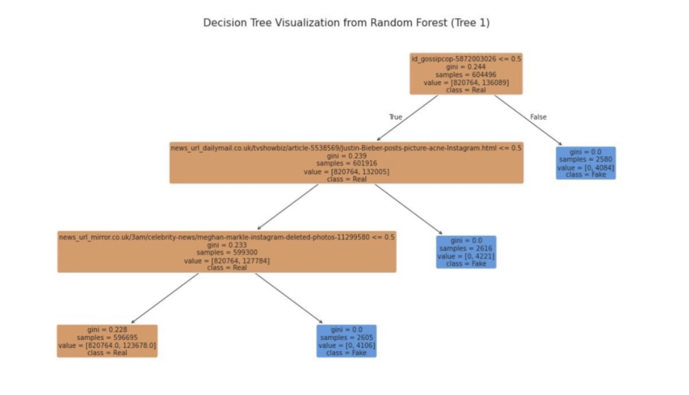
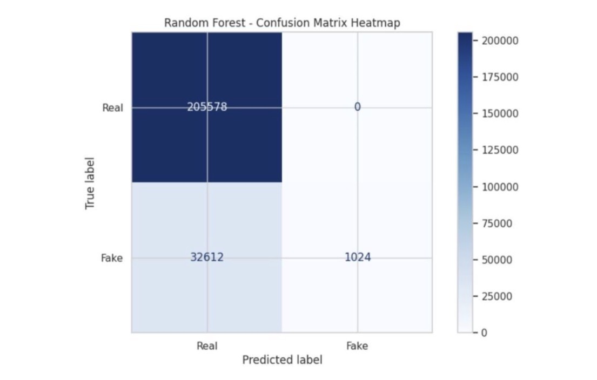

# AI Personalization & Fake News Propagation Analysis

A data science project quantifying how AI recommendation algorithms on platforms 
like TikTok and Instagram Reels affect attention dispersion and the spread of fake 
news. Built as a team project (7 members) with Nywtk Bootcamp, in collaboration 
with the Saudi Digital Academy (SDA), 2026.

## Live Dashboard
🔗 **[Try the interactive dashboard](https://ai-algorithms-attention-fake-news-dnayndd8sq4ndwtxbe82om.streamlit.app)**

Built with Streamlit, the dashboard lets users filter by platform and age group, 
view real-time KPIs (fake-news rate, addiction probability), and compare two 
platforms side-by-side across behavioral and risk metrics.

## My Contribution: Random Forest Architecture (Phase 6)
I built and evaluated an **Ensemble Random Forest Classifier** to improve on the 
baseline Decision Tree model and address its overfitting risk.

- Implemented Bootstrap Aggregation (Bagging) with 10 estimator trees and 
  stochastic feature subspace selection to reduce variance and prevent 
  dominant features from biasing the model
- Visualized individual decision tree topology within the ensemble (300 DPI, 
  max depth 3) to verify structural integrity
- Benchmarked performance against the Decision Tree baseline via a confusion 
  matrix heatmap

### Key Results
- **Random Forest Accuracy: 86.37%** vs. Decision Tree baseline of 84.34%
- Identified a **Class Imbalance Bias**: the model predicted real news with a 
  0% false-positive rate, but only caught 1,024 of 33,636 actual fake news 
  cases (a "Misinformation Detection Deficit")
- Diagnosed the root cause: the dataset merge over-represented real news, 
  causing the model to optimize for the majority class

### Recommendations I Proposed
1. Deploy Random Forest as the production backend for the Streamlit dashboard 
   (more resilient to data drift than a single tree)
2. Address class imbalance using SMOTE or class-weight balancing in future 
   iterations
3. Expand beyond structural metadata (URLs) to NLP embeddings (TF-IDF/BERT) 
   for deeper semantic detection

## Project Overview
- **Data Sources:** AI Recommendation Impact dataset (Kaggle, 50K records), 
  GossipCop Real/Fake News datasets (FakeNewsNet, 21,871 records merged to 
  1.19M records)
- **Pipeline:** Data cleaning → Feature engineering → EDA → Decision Tree → 
  Random Forest → Streamlit deployment
- **Key Finding:** Fake news comprised 14.19% of records overall, with 
  Instagram showing the highest rate (15.94%)

## Tools
Python · Pandas · Scikit-learn · Matplotlib/Seaborn · Streamlit · Plotly

## Full Report
See [Project_Report.pdf](Project_Report.pdf) for the complete analysis 
across all 7 phases.

---
*Note: Streamlit deployment (Phase 7) was built by a teammate; my contribution 
was the Random Forest model (Phase 6) that powers the dashboard's backend.*
